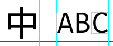
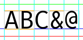
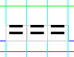
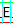
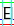

# CodeCJK 決策

* 基礎：Fira Code
* CJK：Noto Sans Mono CJK hk
* &/@：Inconsolata
* unitsPerEm 由基礎字型決定
* 以基礎字型英文大寫及數字最高點為基礎，決定整體字型的中線。所以當中文字和英文大寫及數字放在一起時，英數字的垂直位置都是在中文字的中間

* 非 CJK 的增補字型，都是以英文大寫及數字的最高點為基礎縮放

* CJK 字型縮放以 advance width 為基礎。所以橫字距和原字型沒有太大分別
* 所有 advance width 都對齊
* 字體高度是全形闊度的 17/16，沒有特別原因
* 不使用 ligatures 是因為不需要，不想要，也不想增加開發和維護成本

* ttfautohint 只針對 latin 區。用在中文時，字型的上下位置會非常不穩定
  * E 字中間橫線，在不同大小時的高低位置有點不穩定。我個人希望能令它保持上位，但能力不足。

* 字型名字
  * 只用英文，容易輸入。
  * 沒有空格，就不需要在某類軟件設定檔解決名字空格問題 (如 VS Code)。
  * 考慮過要不要全小寫，輸入時就不用按 shift 鍵。但似乎絕大部份的字型名字都有大寫。所以還是用大小寫。

## 選擇字型

* 純粹我的個人喜好
* 記下這些點主要是怕忘記選擇字型的原因

### Fira Code

* 005 使用的基礎字型
* 不習慣它的 & 和 @
* 其原字型 Fira Mono，我不喜歡它的 0 (zero)

### JetBrains Mono NL

* 004 使用的基礎字型
* 0 (zero) 中間的一點，好像很鬼祟
* H / K 太相似
* 方正大，**英文字太多垂直線**，例如 O / C / D 都有很多垂直線。看 log 的時候就只是看到一大堆垂直線，看得很迷糊

### Inconsolata

* 003 使用的基礎字型
* 005 只使用它的 & 和 @
* 為了解決 Consolas 的授權問題而使用
* **A 字那尖尖的頂部令我眼痛**

### Consolas

* 001-002 使用的基礎字型
* 因為**授權問題**，所以不使用

### Noto Sans Mono CJK hk

* 001 至今的 CJK 區字型
* O0 / 1Il| 完全相撞，所以英數區不能使用
* Noto 包括最多的字元，因為 Noto 是「No tofu」
* 雖然標明 monospace，但 advance width 還是沒有對齊。使用前要先對齊 advance width
* 為何是 hk？因為我是香港人嘛
  * 如果有人需要 jp / kr / sc / tc 的話，請在 github 開 issue。沒有人需要的話，我不想多生枝節

### 細明體

* 不是新細明體，是細明體。細明體是 monospace，新細明體不是 monospace。
* 由 Windows 3.1 開始，因為細明體，我還以為英中文字比例 1:2 是常態。
* O0 / 1Il| 完全相撞。
* 至今(2026年)我對細明體還是心存無限的敬意。
